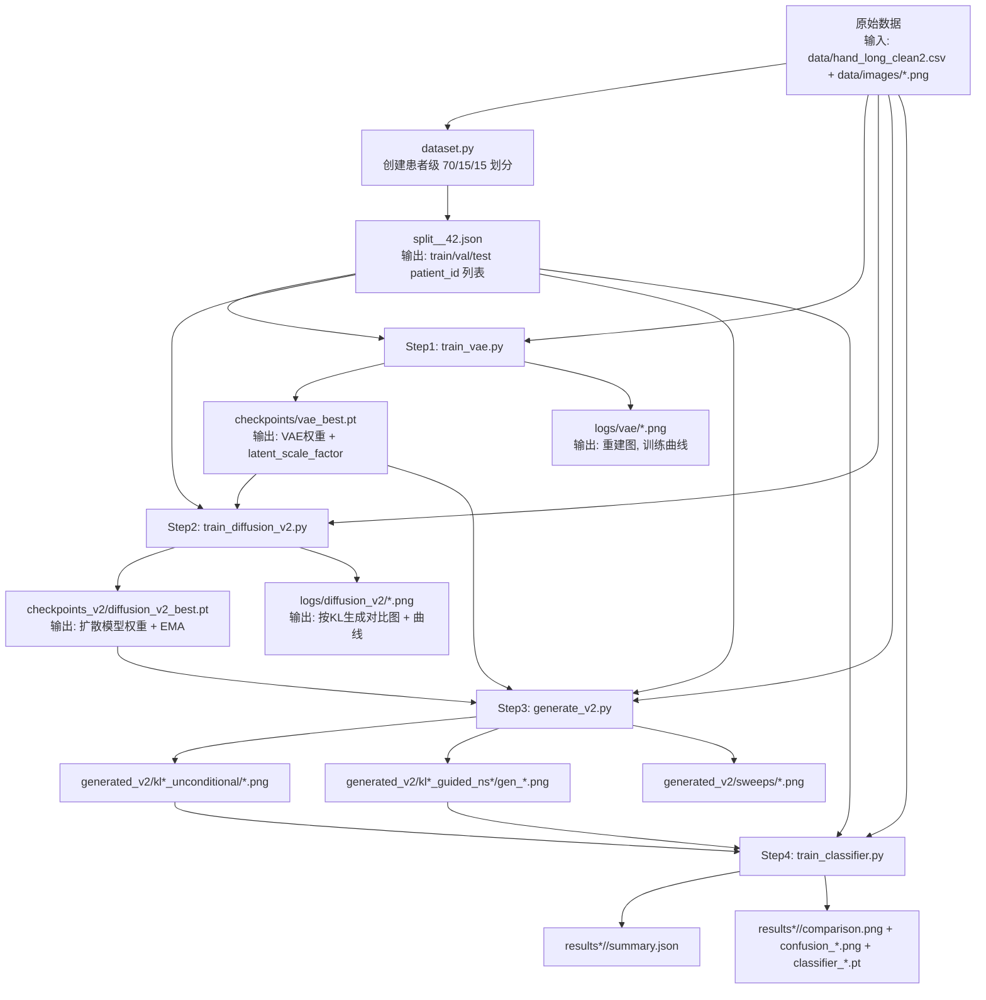

# CS_790_Project 分支代码全流程图（超详细版）

> 面向目标：把这个分支里的训练/生成/评估流程讲清楚，细到“输入文件是什么、作用是什么、输出是什么”。

## 0. 一图总览（主流程）



---

## 1. 数据入口与切分（dataset.py）

### 1.1 输入
- `data/hand_long_clean2.csv`：包含患者、关节、KL 分级（`v00_KL`, `v06_KL`）。
- `data/images/*.png`：ROI 灰度图，文件名格式是 `patientid_joint.png`（例如 `9004905_pip2.png`）。

### 1.2 处理动作
1. **按患者做分层切分**（不是按图片切分）：
   - 每个患者先计算一个 `primary_kl = 该患者所有关节的 KL 最大值`。
   - 在每个 KL 层内做 70/15/15 train/val/test。
   - 目标：防止同一个患者同时进入训练和测试（防泄漏）。
2. **持久化 split 文件**：
   - 自动保存 `split_<joint_types>_<seed>.json`。
3. **构造 DataLoader**：
   - `train` 默认增强（翻转、旋转、平移）。
   - `val/test` 不增强。

### 1.3 输出
- `data/split_<joint>_42.json`（或指定路径）：患者ID划分。
- 训练脚本可直接复用的 `train_loader / val_loader / test_loader`。

---

## 2. Step 1：训练 VAE（train_vae.py）

### 2.1 输入
- 文件输入：
  - `data/hand_long_clean2.csv`
  - `data/images/*.png`
  - `split_<joint>_42.json`（若不存在则自动创建）
- 模型定义输入：`models.py` 中的 `VAE`。

### 2.2 核心作用
- 把 128x128 图像压缩到潜变量（约 `4x16x16`）再重建。
- 训练目标：
  - 重建损失（MSE）
  - KL 散度（带 warmup）
  - 感知损失（VGG16 特征）提升纹理细节
- 训练后额外计算 `latent_scale_factor`，让潜空间方差接近 1，供扩散模型稳定训练。

### 2.3 输出
- `checkpoints/vae_best.pt`
  - `model_state_dict`
  - `latent_scale_factor`（关键）
- `logs/vae/recon_epoch*.png`：原图 vs 重建。
- `logs/vae/training_curves.png`：loss / SSIM 曲线。

---

## 3. Step 2：训练条件扩散模型（train_diffusion_v2.py）

### 3.1 输入
- `checkpoints/vae_best.pt`（冻结 VAE 编码器/解码器，读取 latent_scale_factor）
- `data/hand_long_clean2.csv`, `data/images/*.png`, `split_<joint>_42.json`
- 模型定义：`models.py` 的 `ImprovedConditionalUNet + DiffusionScheduler + EMA`

### 3.2 核心作用
1. 真实图像 `x` 先经 VAE 编码成 `z0`（已按 latent_scale_factor 缩放）。
2. 随机采样扩散时间步 `t`，加噪得到 `zt`。
3. UNet 预测噪声 `eps_pred`，条件为 KL 类别（0~4，另有 5 作为无条件 token）。
4. 采用 min-SNR 加权损失 + CFG dropout + EMA。
5. 定期生成可视化网格，比较 raw 与 EMA 模型效果。

### 3.3 输出
- `checkpoints_v2/diffusion_v2_best.pt`：最佳扩散模型。
- `logs/diffusion_v2/raw_epoch*.png`, `ema_epoch*.png`：每类 KL 采样图。
- `logs/diffusion_v2/training_curves.png`。

---

## 4. Step 3：生成合成图（generate_v2.py）

### 4.1 输入
- `checkpoints/vae_best.pt`
- `checkpoints_v2/diffusion_v2_best.pt`（或 PIP/MCP 对应目录）
- 可选真实源图（guided 模式时）：`data/images/*.png` + split

### 4.2 三种模式与作用
1. **unconditional**
   - 输入：目标 KL（如 3 或 4）+ 随机噪声。
   - 作用：从纯噪声直接采样目标 KL 图像。
2. **guided（SDEdit 风格）**
   - 输入：源图（通常 KL0/1/2）+ 目标 KL + `noise_strength`。
   - 作用：保留结构基础上向目标 KL 迁移，更贴近“病程进展”。
3. **sweep**
   - 输入：一组 `noise_strength` 或 `cfg_scale`。
   - 作用：找更优生成超参。

### 4.3 输出
- 无条件生成：`generated_v2/kl3_unconditional/gen_*.png` 等。
- 引导生成：`generated_v2/kl3_guided_ns0.4/gen_*.png` 等。
- 可视化：
  - `grid_preview.png`
  - `comparison.png`
  - `sweeps/sweep_*.png`, `sweeps/cfg_sweep_*.png`

---

## 5. Step 4：分类器训练与实验对比（train_classifier.py）

### 5.1 输入
- 真实训练数据：`data/hand_long_clean2.csv` + `data/images/*.png` + split。
- 合成图目录：`generated_v2/`（或 `generated_pip/`, `generated_mcp/`）。

### 5.2 实验设置
- `baseline`：仅真实数据，无增强。
- `traditional`：仅真实数据，传统增强。
- `ldm`：真实 + LDM 生成（默认偏 guided）。
- `combined`：真实增强 + LDM 生成。

并且支持：
- 自动挑选 guided 的最优 `noise_strength`（按可用数量）。
- `max_gen_ratio` 控制生成图占比，防止“生成数据淹没真实分布”。
- KL3/KL4 配额规划：尽量平衡两类数量。

### 5.2.1 你问的重点：`train_classifier.py` 默认是不是 `generated_v2`（也就是 DIP）？
- **是的，默认参数就是**：
  - `--gen_dir generated_v2/`
  - `--joint_types DIP`
- 所以如果你直接运行不加参数，分类脚本会按 DIP 的配置去找生成图。
- 但它本质并不“写死 DIP”，你传 `--joint_types PIP --gen_dir generated_pip/` 或 `--joint_types MCP --gen_dir generated_mcp/` 就会切换到对应关节。

### 5.2.2 `train / val / test` 是如何选出来的？
1. 先按 `joint_types` + `seed` 决定 split 文件名：`split_<joint>_<seed>.json`。
2. 如果 split 文件已存在就直接加载；不存在就现场创建（患者级切分，防止泄漏）。
3. 数据集构造方式：
   - `val_dataset`：只用 split 里的 `val` 患者，不增强。
   - `test_dataset`：只用 split 里的 `test` 患者，不增强。
   - `train_dataset`：
     - `baseline`：真实 train 患者，不增强；
     - `traditional`：真实 train 患者，增强；
     - `ldm/combined`：真实 train + 生成图（再按配额裁剪）。

### 5.2.3 它到底用了哪种 noise（0.3/0.4/0.5）的生成图？
- 关键由 `--guided_ns` 决定：
  - 如果你显式传了 `--guided_ns 0.4`，就只选目录名里 `guided_ns0.4` 的图。
  - 如果你不传（默认 `None`），它会统计可用 guided 目录里各 `ns` 的图片数量，**自动选择数量最多的那个 noise_strength**。
- 默认 `--guided_only=True`，所以默认只吃 guided 图，不吃 unconditional。

### 5.3 输出
- `results*/<joint>/summary.json`：各实验最终指标。
- `results*/<joint>/comparison.png` + `_per_class.png`：对比图。
- `results*/<joint>/confusion_*.png`：混淆矩阵。
- `results*/<joint>/classifier_*.pt`：各实验分类模型权重。

---

## 6. 关键“输入->作用->输出”速查表

| 步骤 | 输入文件/目录 | 作用 | 输出文件/目录 |
|---|---|---|---|
| 数据切分 | `data/hand_long_clean2.csv` | 患者级分层 70/15/15，防泄漏 | `split_<joint>_42.json` |
| VAE训练 | CSV + `data/images` + split | 学习图像潜空间表示 + 重建器 | `checkpoints/vae_best.pt` + `logs/vae/*` |
| 扩散训练 | `vae_best.pt` + CSV/images + split | 在潜空间按 KL 条件建模噪声反演 | `checkpoints_v2/diffusion_v2_best.pt` + `logs/diffusion_v2/*` |
| 图像生成 | `vae_best.pt` + diffusion ckpt (+ 源图可选) | 产出 KL3/4 合成图（无条件/引导） | `generated_*/kl*_*/gen_*.png` + sweeps |
| 分类评估 | 真实训练集 + 合成图目录 + split | 比较 baseline/traditional/ldm/combined | `results*/<joint>/summary.json` + 图 + 模型 |

---

## 7. 调度脚本如何串起全流程（jobs/*.sh）

- `jobs/train_vae.sh`：先训 VAE。
- `jobs/train_diffusion_v2.sh`（以及 pip/mcp 版本）：再训扩散模型。
- `jobs/generate_v2.sh`（以及 pip/mcp/extra）：做 sweep + 大规模生成。
- `jobs/classify_v2.sh` / `jobs/classify_all.sh`：跑四组分类实验并汇总。

可理解为：

```text
train_vae.sh
   -> train_diffusion_*.sh
      -> generate_*.sh
         -> classify_*.sh
```

---

## 8. 最终可复现“最小闭环”命令（DIP 示例）

```bash
python train_vae.py --data_dir data/ --joint_types DIP
python train_diffusion_v2.py --data_dir data/ --vae_ckpt checkpoints/vae_best.pt --joint_types DIP
python generate_v2.py --mode guided --target_kl 3 --noise_strength 0.4 --joint_types DIP --output_dir generated_v2/
python train_classifier.py --joint_types DIP --gen_dir generated_v2/ --experiment all --output_dir results_v2/
```


---

## 9. FAQ：`generated_v2` 到底对应哪个关节？三种关节怎么生成？

### Q1: `generated_v2` 是什么关节？
- 从代码默认参数看，`generate_v2.py` 的 `--joint_types` 默认是 `['DIP']`，`--output_dir` 默认是 `generated_v2/`，所以**不传参数时，`generated_v2` 通常是 DIP 关节**。
- 从作业脚本看，`jobs/generate_v2.sh` 也是按 DIP 的默认路径在跑；而 PIP/MCP 分别用了 `generated_pip/` 和 `generated_mcp/`。

### Q2: 如果要生成 3 种关节（DIP/PIP/MCP）怎么办？
最稳妥方式是**分开跑 3 次**，每次指定不同关节和输出目录（避免混在一起）：

```bash
# DIP
python generate_v2.py --mode guided --joint_types DIP --target_kl 3 --noise_strength 0.4 \
  --diff_ckpt checkpoints_v2/diffusion_v2_best.pt --output_dir generated_v2/

# PIP
python generate_v2.py --mode guided --joint_types PIP --target_kl 3 --noise_strength 0.4 \
  --diff_ckpt checkpoints_pip/diffusion_v2_best.pt --output_dir generated_pip/

# MCP
python generate_v2.py --mode guided --joint_types MCP --target_kl 3 --noise_strength 0.4 \
  --diff_ckpt checkpoints_mcp/diffusion_v2_best.pt --output_dir generated_mcp/
```

> 注意：虽然脚本参数支持 `--joint_types` 传多个值，但在工程实践上推荐“每次一个关节 + 独立 output_dir + 对应 checkpoint”，这样后续分类评估最清晰、最不容易串数据。
